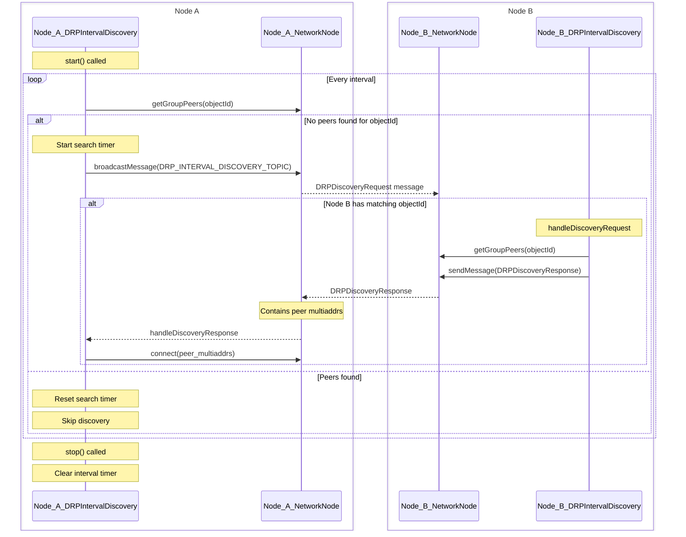

# DRP Interval Discovery

The DRP Interval Discovery system is a crucial component of the Distributed Resource Protocol (DRP) that enables peer discovery and connection maintenance between nodes sharing the same object IDs.

## Overview

The interval discovery mechanism ensures that nodes with shared object IDs can:
- Discover each other on the network
- Maintain connections with peers
- Handle peer discovery and connection establishment gracefully

## Architecture

The interval discovery system consists of three main components:
- `DRPIntervalDiscovery`: Manages the discovery process for a specific object ID
- `IntervalRunner`: Handles the periodic execution of discovery tasks
- `NetworkNode`: Handles P2P communication between nodes

### Sequence Diagram

The following sequence diagram illustrates the discovery process:



## Configuration

The interval discovery system can be configured with the following options:

```typescript
interface DRPIntervalDiscoveryOptions {
    /** Unique identifier for the object */
    readonly id: string;
    /** Network node instance used for peer communication */
    readonly networkNode: DRPNetworkNode;
    /** Interval in milliseconds between discovery attempts. Defaults to 10,000ms */
    readonly interval?: number;
    /** Logger configuration options */
    readonly logConfig?: LoggerOptions;
    /** Duration in milliseconds to search for peers before giving up. Defaults to 5 minutes */
    readonly searchDuration?: number;
}
```

## Key Features

1. **Periodic Discovery Checks**
   - Default interval: 10 seconds
   - Configurable through `interval` option

2. **Peer Discovery**
   - Broadcasts discovery messages when no peers are found
   - Uses `DRP_INTERVAL_DISCOVERY_TOPIC` for discovery messages
   - Includes object ID for targeted peer matching

3. **Connection Management**
   - Automatically connects to discovered peers
   - Maintains connections with active peers
   - Handles peer multiaddress information

4. **Search Duration**
   - Default duration: 5 minutes
   - Configurable through `searchDuration` option
   - Prevents indefinite searching for unavailable peers

## Usage

```typescript
import { createDRPDiscovery } from "@ts-drp/interval-discovery";

// Create a new discovery instance
const discovery = createDRPDiscovery({
    id: "unique-object-id",
    networkNode: networkNode,
    interval: 10000,  // 10 seconds
    searchDuration: 300000  // 5 minutes
});

// Start the discovery process
discovery.start();

// Stop the discovery process when done
discovery.stop();
```

## Message Types

The discovery system uses two main message types:

1. **DRPDiscoveryRequest**
   - Broadcast to discover peers
   - Contains the object ID being searched for

2. **DRPDiscoveryResponse**
   - Sent in response to discovery messages
   - Contains peer multiaddresses for connection establishment
   - Includes subscriber information for all peers sharing the object ID

## Error Handling

The discovery system includes:
- Logging of failed peer discoveries and connections
- Automatic retry mechanism within search duration
